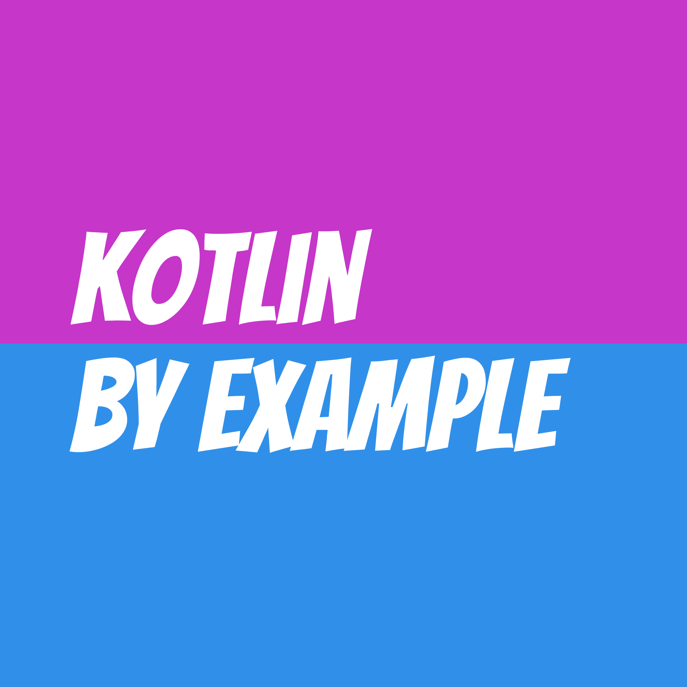

# 예제로 격파하는 코틀린

## 코틀린 Kotlin 프로그래밍 언어

젯브레인스(JetBrains)에서 만든 프로그래밍 언어 코틀린(Kotlin)은, 자바(Java)에서 더 발전한 현대적인 프로그래밍 언어입니다. 자바와 매우 비슷해 변화가 크지 않으면서도, 최신 프로그래밍 언어에 있는 세련된 기능들이 잘 녹아들어 있어 훨씬 깔끔하고 편하게 개발할 수 있습니다.

이미 그 가치를 널리 인정받아서, 안드로이드 앱을 개발하는 표준 언어로 자리잡았습니다. 안드로이드 개발 뿐만 아니라, 백엔드 개발에도 자바의 사실상 표준 프레임워크라고 볼 수 있는 스프링에서도 코틀린을 표준으로 지원하고 있을만큼 환영받고 있습니다. 아마도 조만간, 자바의 현재 위치를 대체할 수 있을 거라고 보는 사람이 많을 겁니다.

## 자료 소개

이 웹사이트는, 코틀린 공식 홈페이지에 있는 [Kotlin by example](https://play.kotlinlang.org/byExample/overview)이라는 문서를 편역해 구성했습니다. 원문을 성실히 번역하겠다는 욕심은 버리고, 구성과 예제를 거의 그대로 가져오되, 한국어로 표현하기 좋은 문장으로 바꾸었고, 편역자 편의에 따라 예제도 수정하였습니다. 원문도 자유로운 라이선스 정책을 선택했기에, 이 편역본도 자유로운 라이선스로 공개하겠습니다.

* <https://github.com/hatemogi/kotlin-by-example>

제안하실 내용이 있으면, PR을 보내주시면 감사하겠습니다.

## 대상 독자

자바 개발을 하다가 코틀린으로 이전해야 하는 백엔드 개발자나, 안드로이드 앱 개발을 위해서 새로이 코틀린을 배우는 분들을 포함해서, 코틀린의 다양한 문법을 빠르게 알아보고 싶은 분들을 대상으로 작성했습니다. 예제 코드 중심으로 다양한 문법을 소개합니다. 글로는 다소 어렵게 느껴지는 내용도, 예제 코드를 통해 쉽게 이해할 수 있습니다. 코드를 따라 읽으며 코틀린의 편리한 문법들을 한눈에 파악하실 수 있습니다. 긴 글을 읽기보다 예제 코드를 중심으로 학습하시려는 분들에게 적합합니다.

## 예제 중심 실습 환경

이 웹사이트의 예제 코드는 웹브라우저 환경에서 곧바로 실습해 볼 수 있습니다. 별도의 개발 환경을 설정하지 않고도, 예제 코드가 보이는 웹 페이지에서 곧바로 실행해 결과를 확인해 볼 수 있어서, 궁금한 내용으로 편집해가며 실습하실 수 있습니다.

## 저자 소개

김대현은, 카카오(Daum), NHN, LINE+에서 개발자, 개발팀장으로 일한 경험이 있습니다. 다양한 프로그래밍 언어로 실무 개발에 임했고, 그 중 코틀린도 백엔드 개발에 유용하게 활용한 경력이 있습니다. 자바로 할 수 있던 일들은 대부분 코틀린이 훨씬 더 편하게, 그리고 부담없이 대체할 수 있다고 믿고 있습니다.

## 강의 제작 예정

이 책은, 온라인 강의로 제작 예정입니다. 유료 강의를 공개하더라도, 이 책은 계속 무료로 제공하며, 자유롭게 활용하실 수 있습니다. 강의가 공개되면, 이 자리에 링크를 추가하겠습니다.

그럼, 아래에 다음 버튼을 눌러 학습을 시작해보세요!

> 연락처: hatemogi at gmail.com